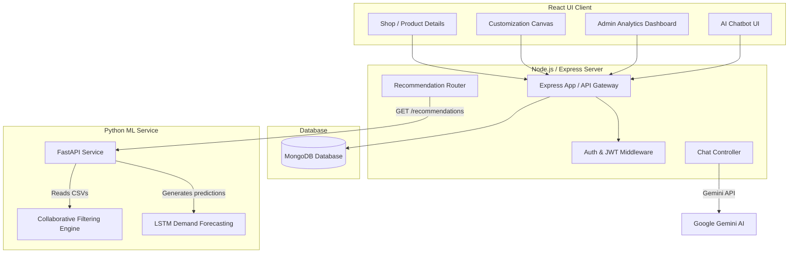

# 🛍️ Smart E-Commerce Ecosystem (Phase 2)

An intelligent, AI-powered e-commerce ecosystem designed specifically for apparel SMEs (Small and Medium Enterprises). This platform extends a traditional online clothing store with customized canvas design features, an AI customer chatbot, admin/producer analytics dashboards, and Python-based machine learning services for demand forecasting and personalized product recommendations.

---

## 🏗️ System Architecture

The ecosystem follows a microservice-oriented architecture where the React frontend connects to the Express API backend, which coordinates with MongoDB and a Python FastAPI ML service.



---

## ✨ Features

### 🛒 Customer Experience
* **E-Commerce Shop**: Browse catalog, filter items by category, view product details, add to cart, and checkout.
* **Interactive Customization Canvas**: An interactive studio powered by **Fabric.js** where users can customize their clothing/designs before ordering.
* **AI-Powered Chatbot**: Seamless assistance and inquiries via a built-in chatbot integrated with Google's Gemini API.
* **User Profile & Orders**: Manage customer profile details and track real-time order history.

### 📊 Admin & Producer Dashboards
* **Dashboard Overview**: Financial KPIs, total sales, user signups, and live inventory highlights.
* **Product & Category Management**: Easy creation, updating, and categorization of items.
* **Order & Inventory Tracking**: Keep tabs on pending orders and track stock levels dynamically.
* **Supplier Management**: Register and track apparel suppliers and raw material streams.
* **Advanced Analytics**: Visual graphs representing sales performance, customer trends, and stock allocations using Recharts.

### 🧠 AI & Machine Learning Services
* **Collaborative Filtering Recommendations**: Cosine similarity-based model recommending products based on historical user purchase vectors.
* **LSTM Demand Forecasting**: Deep learning LSTM model trained on WooCommerce sales data to forecast future apparel sales demand.

---

## 📁 Project Structure

```text
E-commerce-Web-Clothing-Store-/
├── backend/                  # Node.js + Express API Backend
│   ├── src/
│   │   ├── config/           # Database configuration
│   │   ├── controllers/      # Route controllers (auth, chat, admin, etc.)
│   │   ├── middleware/       # JWT Authentication & authorization middleware
│   │   ├── models/           # Mongoose schemas (Product, Order, User, etc.)
│   │   ├── routes/           # REST endpoints
│   │   ├── services/         # Shared business logic services
│   │   └── server.js         # Entry point
│   ├── package.json
│   └── uploads/              # Static file/image uploads directory
│
├── frontend/                 # React.js + Vite + Tailwind CSS Frontend
│   ├── src/
│   │   ├── api/              # Axios API clients
│   │   ├── auth/             # Authentication contexts and route guards
│   │   ├── cart/             # Shopping cart context and state
│   │   ├── components/       # Shared UI components (Navbar, Chatbot, etc.)
│   │   ├── pages/            # View pages (Shop, Customizer, Dashboard, etc.)
│   │   ├── App.jsx           # App layout and routes
│   │   └── main.jsx          # Vite entrypoint
│   ├── index.html
│   └── package.json
│
└── ml-service/               # Python ML forecasting & recommendation service
    ├── app.py                # FastAPI endpoints
    ├── recommendation_model.py # Cosine similarity collaborative filter
    ├── train_lstm.py         # LSTM model training script
    ├── sales_data.csv        # Dataset used to train the LSTM
    └── requirements.txt      # Python dependencies
```

---

## ⚙️ Installation & Setup

### Prerequisites
* **Node.js** (v16+)
* **npm** or **yarn**
* **MongoDB** (Local instance or MongoDB Atlas URI)
* **Python** (v3.8+)
* **Gemini API Key** (for Chatbot functionality)

---

### 1. Backend Setup

1. Navigate to the backend directory:
   ```bash
   cd backend
   ```
2. Install dependencies:
   ```bash
   npm install
   ```
3. Create a `.env` file in the `backend/` directory:
   ```env
   PORT=5000
   MONGODB_URI=your_mongodb_connection_uri
   JWT_SECRET=your_jwt_secret_key
   GEMINI_API_KEY=your_gemini_api_key
   ```
4. Start the server (development mode with Nodemon):
   ```bash
   npm run dev
   ```

---

### 2. Frontend Setup

1. Navigate to the frontend directory:
   ```bash
   cd frontend
   ```
2. Install dependencies:
   ```bash
   npm install
   ```
3. Start the Vite development server:
   ```bash
   npm run dev
   ```
4. The client will be available at `http://localhost:5173`.

---

### 3. ML Service Setup

1. Navigate to the ML service directory:
   ```bash
   cd ml-service
   ```
2. Create a virtual environment and activate it:
   ```bash
   python -m venv venv
   # On Windows:
   venv\Scripts\activate
   # On macOS/Linux:
   source venv/bin/activate
   ```
3. Install required libraries:
   ```bash
   pip install -r requirements.txt
   ```
4. Train the LSTM model:
   ```bash
   python train_lstm.py
   ```
5. Run the FastAPI recommendation API:
   ```bash
   uvicorn app:app --port 8000 --reload
   ```

---

## 🔗 Main API Endpoints

### Backend Routes (`http://localhost:5000/api`)
* `POST /auth/register` - Register a new account
* `POST /auth/login` - Authenticate user & get JWT token
* `GET /products` - Fetch all products
* `GET /orders` - Fetch orders for logged-in user
* `POST /orders` - Place a new order
* `GET /recommendations/:userId` - Proxy request to ML service and return recommended products
* `POST /chat` - Interact with the AI assistant chatbot

### ML Service Routes (`http://localhost:8000`)
* `GET /` - Check ML service status
* `GET /recommendations?userId=<userId>` - Collaborative filtering recommendation recommendations

---

## 📊 Recommendation System Mechanism

The recommendation microservice analyzes historical user-product interactions via **Collaborative Filtering**:
1. Creates a **Pivot Table** mapping users (`userId`) to purchased items (`productId`) count.
2. Calculates **Cosine Similarity** between users to find users with similar purchase behaviors.
3. Selects the top-2 most similar users.
4. Suggests products that similar users bought, but the target user has not purchased yet.
5. Returns raw `productIds` to the Express backend, which resolves details from MongoDB and sends them to the customer interface.

---

## 📜 License

This project is licensed under educational and research guidelines.

⭐ *If you find this project useful, feel free to give the repository a star!*
